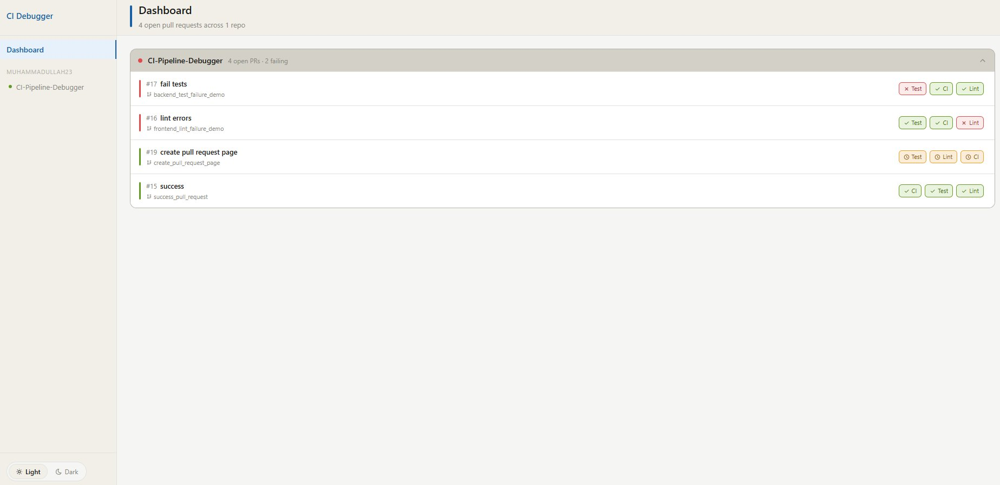
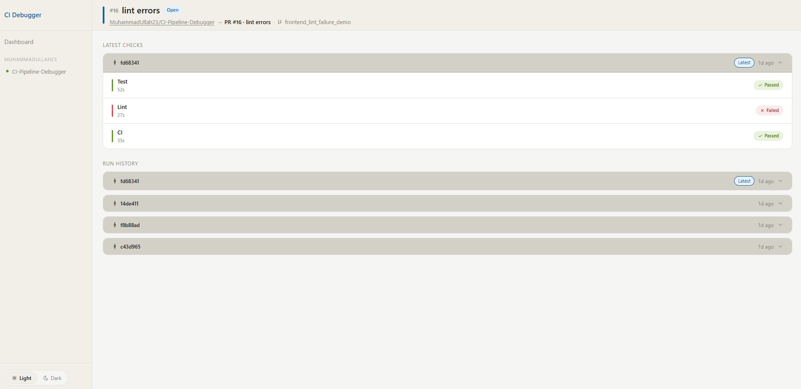
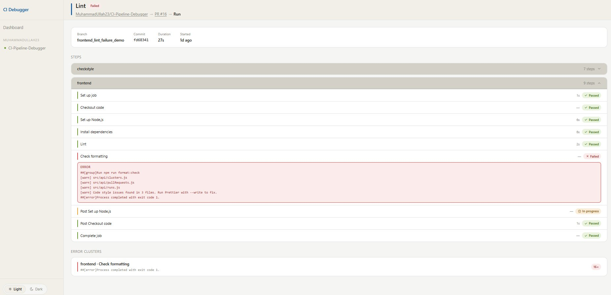
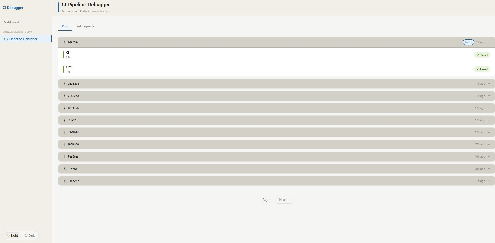
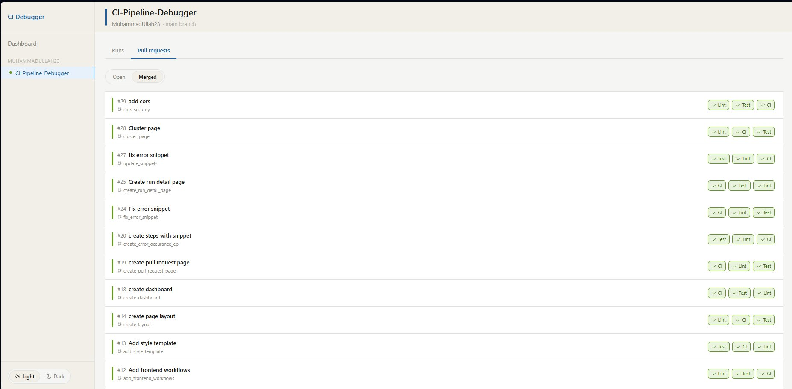
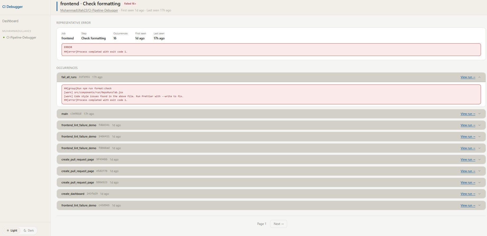

# CI Pipeline Visual Debugger
 
A full-stack observability tool for CI/CD pipelines. Ingests GitHub Actions webhook data, processes pipeline run and step-level information, clusters recurring errors, and presents results through a visual dashboard.
 
Built to demonstrate full-stack engineering skills including REST API design, asynchronous job processing, database schema design, provider-agnostic architecture, and modern React frontend development.
 
---
 
## Screenshots

#### Dashboard
Open PRs grouped by repo with workflow status chips



#### Pull Request Detail
Latest checks and paginated run history grouped by commit



#### Run Detail
Step tree with inline error snippets and linked error clusters



#### Repo View — Runs
Main branch commit sets paginated by commit



#### Repo View — Pull Requests
Open/merged PR list with workflow chips



#### Cluster Detail
Representative error and paginated occurrence history



---
 
## Tech Stack
 
| Layer | Technology |
|---|---|
| Language | Java 21 |
| Framework | Spring Boot 3.5 |
| Database | PostgreSQL 15 |
| Migrations | Flyway (Spring Boot managed) |
| ORM | Hibernate / Spring Data JPA |
| Containerization | Docker / Docker Compose |
| Frontend | React 19, Vite, TanStack Query, React Router v6, Tailwind v4 |
 
---
 
## Architecture Overview
 
```
GitHub Webhook
      │
      ▼
GitHubWebhookController     — validates HMAC signature, deserializes payload
      │
      ▼
PipelineRunService          — upserts pipeline run (idempotent)
      │  action == completed
      ▼
ProcessingJobService        — enqueues GITHUB_FETCH_STEPS job
      │
      · · · @Scheduled poller · · ·
      │
      ▼
GitHubStepsApiClient        — fetches step data from GitHub REST API
      │
      ▼
PipelineStepService         — persists step rows to database
      │  run has failures
      ▼
ErrorIngestionService       — fingerprints errors, finds or creates clusters
      │
      ▼
ErrorCluster / ErrorOccurrence — persisted for dashboard surfacing
```
 
---
 
## Local Setup
 
### Prerequisites
- Java 21
- Maven 3.9+
- Docker and Docker Compose
- Node.js 20+
### 1. Start the database
 
```bash
docker-compose up -d postgres
```
 
### 2. Configure environment variables
 
Create a `.env` file in the project root:
 
```env
DB_URL=jdbc:postgresql://localhost:5432/ci_debugger
DB_USERNAME=your_db_user
DB_PASSWORD=your_db_password
GITHUB_WEBHOOK_SECRET=your_webhook_secret
GITHUB_API_TOKEN=your_github_token
GITHUB_API_CONNECT_TIMEOUT_MS=5000
GITHUB_API_READ_TIMEOUT_MS=10000
JOB_SCHEDULER_INTERVAL_MS=5000
```
 
### 3. Start the backend
 
```bash
cd backend
./mvnw spring-boot:run -Dspring-boot.run.profiles=dev
```
 
### 4. Start the frontend
 
```bash
cd frontend
npm install
npm run dev
```
 
The dashboard is available at `http://localhost:5173`.
 
### 5. Configure GitHub webhook
 
In your GitHub repository settings, add a webhook pointing to your backend:
 
- **Payload URL:** `https://your-domain/webhooks/github` (use ngrok for local development)
- **Content type:** `application/json`
- **Secret:** the value of `GITHUB_WEBHOOK_SECRET`
- **Events:** Workflow runs, Pull requests
---
 
## Running Tests
 
```bash
cd backend
./mvnw test
```
 
---
 
## Phases
 
### ✅ Phase 1 — GitHub Webhook Ingestion
 
Establishes the webhook ingestion pipeline for GitHub Actions `workflow_run` events.
 
**What's included:**
- `POST /webhooks/github` endpoint
- HMAC-SHA256 signature verification via `X-Hub-Signature-256` header
- Payload deserialization and mapping to internal `PipelineRunUpsertRequest`
- Idempotent upsert of `pipeline_run` rows — safe to call on `requested`, `in_progress`, and `completed` events for the same run
- Write-once metadata policy — `workflowName`, `headSha`, `branch`, and `startedAt` are never overwritten by a later webhook
- Provider-agnostic service layer — `PipelineRunService` has no knowledge of GitHub specifics
- Exception handling via `ServiceException` with typed `ErrorCode` enum and `GlobalExceptionHandler`
- Dev-only `PipelineRunDevController` for seeding and inspecting run data
**Key design decisions:**
- One controller per provider (not a unified webhook controller)
- `provider_run_id` stored as `varchar(100)` to support non-numeric IDs from future providers
---
 
### ✅ Phase 2 — Step-Level Data Ingestion
 
Adds asynchronous background processing to fetch and persist step-level data from the GitHub API after a run completes.
 
**What's included:**
- `processing_job` table with retry logic, exponential backoff, and partial unique index on active jobs
- `pipeline_step` table with unique constraint on `(pipeline_run_id, job_name, step_index)`
- Idempotent `ProcessingJobService.enqueue()` — returns existing job if one is already active or completed for the same run
- `@Scheduled` job processor polling for `PENDING` jobs on a configurable interval
- `JobHandler` interface with `GitHubFetchStepsJobHandler` implementation — extensible for future providers
- `GitHubStepsApiClient` — calls `GET /repos/{owner}/{repo}/actions/runs/{runId}/jobs` with configurable connect and read timeouts
- Exponential backoff retry: 30s → 90s → 270s, max 3 attempts
- Jobs marked `FAILED` permanently after all attempts exhausted
- `RunProgressNotifier` interface with `NoOpRunProgressNotifier` for MVP — extension point for future real-time WebSocket updates
- Full unit test coverage across all service, repository, and API client classes
**Key design decisions:**
- Step data only fetched on `completed` webhook — GitHub step data is incomplete mid-run
- `scheduled_at` immutable — records original enqueue time; `next_retry_at` handles retry delay separately
- `JOIN FETCH` on eligible jobs query — avoids lazy loading proxy errors outside transaction scope
- Provider-specific job types — prevents handler map conflicts when GitLab/CircleCI support is added
---
 
### ✅ Phase 3 — Error Clustering
 
Groups recurring step failures across runs to surface patterns and repeated errors.
 
**What's included:**
- `error_cluster` table — recurring failure patterns identified by `owner + repo + job_name + step_name + conclusion` with SHA-256 fingerprint
- `error_occurrence` table — links a cluster to a specific pipeline run and step with log snippet
- `GitHubLogsApiClient` — downloads GitHub Actions log zip, unzips in memory, extracts `[ERROR]` and `##[error]` prefixed lines
- `ErrorIngestionService` — provider-agnostic, finds or creates clusters via fingerprint, saves occurrences in one transaction
- Single combined job type `GITHUB_FETCH_LOGS_AND_CLUSTER` — triggered after step fetch completes on failed runs
**Key design decisions:**
- Single combined job type avoids data handoff problem between async jobs
- `ErrorIngestionService` signature uses `Map<PipelineStep, String>` — provider-agnostic
- Log parsing extracts error lines only — full logs discarded after parsing, not stored
- `step_log` table dropped — log parsing too unstructured to be worth storing raw logs
---
 
### ✅ Phase 4 — REST API
 
Exposes pipeline run, step, and error cluster data via a REST API for consumption by the dashboard frontend.
 
**What's included:**
- `GET /api/runs` — all repos grouped by owner → repo → workflowName, 5 most recent runs per workflow
- `GET /api/runs/{owner}/{repo}` — paginated main branch runs for a specific repo
- `GET /api/runs/{owner}/{repo}/run-sets` — main branch runs grouped by commit set, paginated
- `GET /api/runs/{id}` — single run detail with `pullRequestId` and `prNumber`
- `GET /api/runs/{id}/steps` — all steps for a run with inline `errorSnippet` on failed steps
- `GET /api/runs/{id}/clusters` — error clusters triggered by a specific run
- `GET /api/repos` — repo health summaries based on latest main branch run per workflow
- `GET /api/clusters` — all clusters sorted by `occurrence_count DESC`
- `GET /api/clusters/{id}?page=0` — single cluster detail with paginated occurrences
- `GET /api/pull-requests/open` — open PRs with latest run per workflow
- `GET /api/pull-requests/{owner}/{repo}?status=open|merged` — repo-scoped PR list with latest runs
- `GET /api/pull-requests/{id}` — PR detail with paginated run history
- `GET /api/pull-requests/{id}/run-sets?page=0` — PR runs grouped by commit set, paginated
- Full unit test coverage across all service methods
**Key design decisions:**
- Backend handles all grouping and pagination — not the frontend
- `RunSummaryResponse` as a lean DTO for list views — full `PipelineRunResponse` for detail endpoint
- `readOnly = true` on all read service methods — skips Hibernate dirty checking
---
 
### ✅ Phase 5 — Pull Request Tracking
 
Extends pipeline run ingestion to capture PR metadata, enabling PR-level views on the dashboard.
 
**What's included:**
- `pull_request` table with unique constraint on `(provider, owner, repo, pr_number)`
- `pr_id` FK on `pipeline_run` linking runs to their originating PR
- `GITHUB_FETCH_PR_DETAILS` job type — fetches PR title, state, and head SHA from GitHub pulls API
- Minimal PR row created immediately on webhook arrival, details populated asynchronously
- Concurrent insert handling in `findOrCreate()` — safe under parallel webhook delivery
- `pull_request` webhook event handling — PR state updated to `MERGED` or `CLOSED` on close
- CI, Test, and Lint GitHub Actions workflows with Checkstyle enforcement
- Testcontainers for real PostgreSQL testing in CI
- PostgreSQL JDBC driver updated to `42.7.11` to address CVE
**Key design decisions:**
- PR row created upfront on webhook arrival — `pr_id` set before job processing begins
- `GITHUB_FETCH_PR_DETAILS` skips API call if `prState != null` — idempotent enrichment
- Dashboard query partitions by `(pr_id, workflow_name)` — latest run per workflow per PR
---
 
### ✅ Phase 6 — Dashboard Frontend
 
Visual React frontend for exploring pipeline runs, step timelines, and error clusters.
 
**What's included:**
- **Dashboard** — open PRs grouped by repo with latest workflow status chips, collapsible repo sections
- **RepoView** — main branch commit sets (paginated) and PR list with open/merged toggle
- **PullRequestDetail** — PR header, latest workflow checks, paginated run history grouped by commit
- **RunDetail** — run metadata, step tree grouped by job (auto-expands failed jobs), inline error snippets, linked error clusters
- **ClusterDetail** — cluster metadata, representative error, paginated occurrence history with branch and commit context
- Light/dark theme with CSS variables and localStorage persistence
- Smooth collapse/expand animations via CSS `grid-template-rows` transitions
- TanStack Query for data fetching with 30s polling on live data
- Smart polling on step data — polls every 3s until steps and error snippets are populated
- CORS configured for local development
**Key design decisions:**
- All pages are component-first — tab content, PR cards, run sets, step rows, occurrence rows each in their own component
- Navigation state not used for breadcrumbs — `pullRequestId` and `prNumber` included in run response so breadcrumbs work on direct URL access
- In-memory pagination for commit sets (headSha grouping) — avoids native query LIMIT/OFFSET issues with Spring Data JPA
- `grid-template-rows: 0fr → 1fr` transition for collapse animations — no JS height calculation needed
---
 
## MVP Limitations
 
The following are known limitations consciously deferred in favour of a simpler MVP:
 
- **Step data loss** — if a job fails all 3 retries, step data is lost unless manually re-enqueued
- **Single GitHub API token** — not per-user; OAuth deferred to a future phase
- **No stuck job recovery** — jobs stuck in `IN_PROGRESS` are never automatically reset
- **No dead letter queue** — permanently failed jobs require manual database intervention
- **No real-time updates** — dashboard polls every 30s; `RunProgressNotifier` is a no-op
- **No pre-computed performance snapshots** — all metrics derived at query time
- **GitHub only** — GitLab and CircleCI deferred to a future phase
- **CORS origins** — currently configured for `localhost:5173` only; production URL must be added before deployment